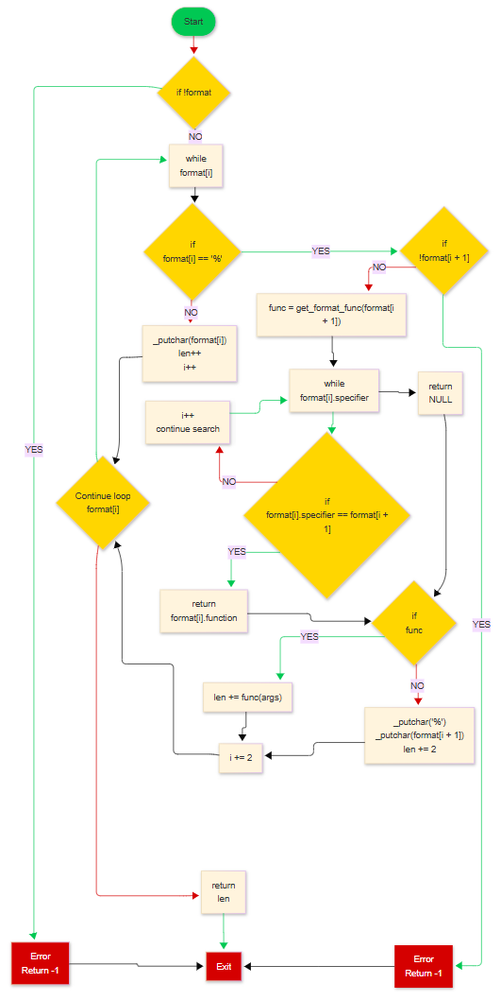

# 📝 holbertonschool-printf

A custom implementation of the `printf` function in C language, developed as part of the Holberton School curriculum.

## 📋 Table of Contents

- [Description](#description)
- [Features](#features)
- [Installation](#installation)
- [Usage](#usage)
- [Supported Format Specifiers](#supported-format-specifiers)
- [Project Structure](#project-structure)
- [Examples](#examples)
- [Compilation](#compilation)
- [Tests](#tests)
- [Authors](#authors)

## 🎯 Description

This project implements a simplified version of the `printf` function from the C standard library. The `_printf` function produces output according to a specified format and writes to standard output.

## ✨ Features

- ✅ Support for basic format specifiers
- ✅ Variable arguments support
- ✅ Returns the number of characters printed
- ✅ Error handling for unrecognized specifiers
- ✅ Optimized and simplified code for better performance
- ✅ Code compliant with Holberton coding standards

## 🚀 Installation

```bash
# Clone the repository
git clone https://github.com/JordannM83/holbertonschool-printf.git

# Navigate to the directory
cd holbertonschool-printf

# Compile the project
gcc -Wall -Werror -Wextra -pedantic -std=gnu89 *.c -o printf_test
```

## 💻 Usage

```c
#include "main.h"

int main(void)
{
    _printf("Hello, %s!\n", "World");
    _printf("Character: %c\n", 'A');
    _printf("Number: %d\n", 42);
    _printf("Integer: %i\n", -123);
    _printf("Percent sign: %%\n");
    return (0);
}
```

## 📝 Supported Format Specifiers

| Specifier | Description | Example |
|-----------|-------------|---------|
| `%c` | Single character | `_printf("%c", 'A')` → `A` |
| `%s` | String of characters | `_printf("%s", "Hello")` → `Hello` |
| `%d` | Signed decimal integer | `_printf("%d", 42)` → `42` |
| `%i` | Signed decimal integer | `_printf("%i", -123)` → `-123` |
| `%%` | Literal percent character | `_printf("%%")` → `%` |

## 📁 Project Structure

```
holbertonschool-printf/
├── main.h              # Main header file
├── _printf.c           # Main _printf function
├── get_format.c        # Format specifier handler
├── format.c            # Print functions for each format
├── _putchar.c          # Function to print a character
├── man_3_printf        # Manual page
└── README.md           # This file
```

### File Descriptions

#### `main.h`
Contains all function declarations and the optimized `print_t` structure that uses simple characters instead of strings to map specifiers to functions.

#### `_printf.c`
Implements the simplified main function that:
- Parses the format string character by character
- Identifies format specifiers directly
- Calls appropriate functions without temporary allocation
- Accurately counts printed characters

#### `get_format.c`
Contains the optimized `get_format_func` function that:
- Directly compares specifier characters (faster)
- Uses a simplified structure without external dependencies
- Returns a pointer to the appropriate function

#### `format.c`
Implements the optimized print functions:
- `print_char()` - Prints a character and returns 1
- `print_string()` - Prints a string and handles NULL values
- `print_percent()` - Prints the % character and returns 1
- `print_int()` - Prints an integer with optimized algorithm (%i specifier)
- `print_decimal()` - Prints a decimal integer (%d specifier)

## 🔧 Compilation

The project uses the following compilation flags to ensure code quality:

```bash
gcc -Wall -Werror -Wextra -pedantic -std=gnu89 *.c -o test_printf
```

### Flags used:
- `-Wall` : Enables all major warnings
- `-Werror` : Treats warnings as errors
- `-Wextra` : Enables additional warnings
- `-pedantic` : Strictly follows the C standard
- `-std=gnu89` : Uses the GNU C89 standard

## ✅ Tests

To run the tests:

```bash
# Compile
make

# Run tests
./test_printf
```

### Expected output:
```
Let's try to printf a simple sentence.
Let's try to printf a simple sentence.
Length:[39, 39]
Length:[39, 39]
Character:[H]
Character:[H]
String:[I am a string !]
String:[I am a string !]
Percent:[%]
Percent:[%]
Len:[12]
Len:[12]
```

## 🔍 Usage Examples

### Example 1: Character strings
```c
#include "main.h"

int main(void)
{
    int len;
    
    len = _printf("Hello %s, welcome to %s!\n", "Alice", "Holberton");
    _printf("Printed %d characters\n", len);
    
    return (0);
}
```

### Example 2: Characters and numbers
```c
#include "main.h"

int main(void)
{
    char grade = 'A';
    int score = 95;
    
    _printf("Your grade is: %c\n", grade);
    _printf("Your score: %d points\n", score);
    _printf("Age: %i years old\n", 25);
    _printf("Percentage symbol: %%\n");
    
    return (0);
}
```

### Example 3: Negative numbers and zero
```c
#include "main.h"

int main(void)
{
    int positive = 42;
    int negative = -17;
    int zero = 0;
    
    _printf("Positive: %d\n", positive);
    _printf("Negative: %i\n", negative);
    _printf("Zero: %d\n", zero);
    
    return (0);
}
```

## 🛠️ Internal Workings

### Main Algorithm (optimized):

1. **Initialization**: Setup variables and `va_list`
2. **Validation**: Check that `format` is not NULL
3. **Parsing**: Direct character-by-character traversal of format string
4. **Detection**: Identification of specifiers (`%c`, `%s`, `%d`, `%i`, `%%`) without temporary allocation
5. **Execution**: Direct call to appropriate function for each specifier
6. **Counting**: Precise accumulation of printed character count
7. **Return**: Returns total character count

### Implemented optimizations:
- **Direct comparison** of characters instead of strings (eliminates `strcmp`)
- **Integer printing algorithm** with temporary buffer (fewer divisions)
- **Elimination of temporary allocations** (`specifier` array)
- **Robust handling** of edge cases (`INT_MIN`, NULL strings)

### Error handling:
- NULL format: Returns -1
- Format ending with `%`: Returns -1
- Unrecognized specifiers: Prints literally `%` + character
- NULL string: Displays `"(null)"` like real `printf`

## 🚀 Performance and Architecture

### Implemented optimizations:

#### **Simplified data structure**
```c
typedef struct print
{
    char specifier;        // Simple character instead of string
    int (*function)(va_list);  // Function returning number of characters
} print_t;
```

#### **Optimized integer printing algorithm**
- Uses temporary buffer instead of repeated divisions
- Robust handling of `INT_MIN` with `unsigned int`
- Single pass to count and print

#### **Direct comparisons**
- Eliminates `strcmp()` for character comparisons
- Reduces dependencies (no `<string.h>`)

### Complexity:
- **Time**: O(n) where n is the length of the format string
- **Space**: O(1) for variables, O(k) for integer buffer (k ≤ 12)

## 🤝 Contribution

This project is part of the Holberton School curriculum. Contributions are limited to project students.

## 📄 License

This project is developed for educational purposes as part of Holberton School.

## 👥 Authors

- **JordannM83 - Joshuaburle** - *Main developers* - [GitHub](https://github.com/JordannM83)

## Man Page Printf


## Flowchart Printf



---

*Project developed for Holberton School*